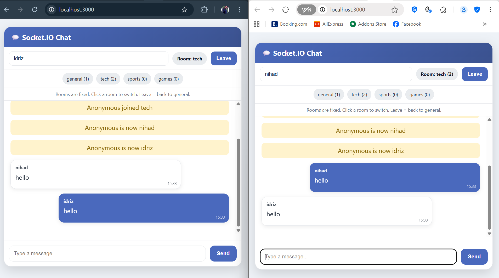

# Nihad Azzam, Sohaib Ebrahimi , Idriz Berisha

# 💬 Socket.IO Chat -sovellus

Tämä on yksinkertainen reaaliaikainen chat-sovellus,joka on toteutettu
**Node.js**, **Express** ja **Socket.IO** -teknologioilla.  
Käyttäjä voi antaa nimimerkin, liittyä huoneeseen ja keskustella muiden kanssa reaaliajassa.

---

## ⚙️ Miten ohjelma toimii

1. Käynnistä palvelin:
   ```bash
   node index.js
    ```
Avaa selaimessa osoite:
```
http://localhost:3000
```

Syötä nimimerkki (esim. Charlie).

Valitse huone (esim. tech).

Kirjoita viesti tekstikenttään ja paina Send.

Viesti näkyy kaikille, jotka ovat samassa huoneessa.

Järjestelmäviestit kertovat, kuka liittyi, poistui tai vaihtoi nimimerkkiä.

Voit aina palata päähuoneeseen (general) napilla Leave.

## 🗂 Koodin selitys

**1) index.js (palvelin)**

express palvelee staattisia tiedostoja kansiosta public/.

socket.io luo reaaliaikaisen yhteyden asiakkaisiin.

Käyttäjä liitetään aluksi huoneeseen general.

Funktiot:

joinRoom(socket, room): lisää käyttäjän huoneeseen ja päivittää käyttäjämäärän.

leaveRoom(socket, room): poistaa käyttäjän huoneesta ja päivittää käyttäjämäärän.

getRoomsSummary(): palauttaa listan huoneista ja käyttäjämääristä.

Tapahtumat:

connection: uusi käyttäjä yhdistää.

set_nickname: käyttäjä muuttaa nimimerkkiä.

chat_message: viesti lähetetään ja broadcastataan saman huoneen jäsenille.

switch_room: käyttäjä vaihtaa huonetta.

leave_room: palaa takaisin päähuoneeseen.

disconnect: yhteys katkeaa.

**2) public/index.html (käyttöliittymä)**

Käyttöliittymä sisältää:

Nimimerkki-kenttä

Huoneen näyttö (badge)

Lista huoneista (chips)

Viestilista

Tekstikenttä + Send-painike

Käyttää tyylejä (CSS) ulkoasuun.

**3) public/main.js (asiakaslogiikka)**

Hallitsee tapahtumat selaimessa:

Lähettää nimimerkin (set_nickname).

Lähettää viestin (chat_message).

Kuuntelee huoneiden listaa (rooms_list) ja näyttää ne.

Näyttää viestit (chat_message, system_message) viestilistassa.

Ilmoittaa, kun käyttäjä kirjoittaa (typing).

Funktiot:

appendMessage(): lisää uuden viestin viestilistaan.

renderChips(): piirtää huoneiden napit keskelle sivua.

scrollToBottom(): scrollaa aina uusimpaan viestiin.

## 📘 Yhteenveto

Palvelin: hallitsee huoneet, nimimerkit ja viestien välityksen.

Asiakas (frontend): tarjoaa käyttöliittymän viestien kirjoittamiseen ja huoneiden vaihtamiseen.

Kaikki viestit pysyvät huonekohtaisina: vain saman huoneen jäsenet näkevät ne.

## Käyttöliittymän esimerkki




